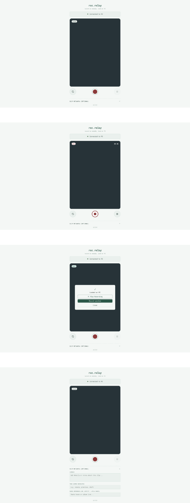
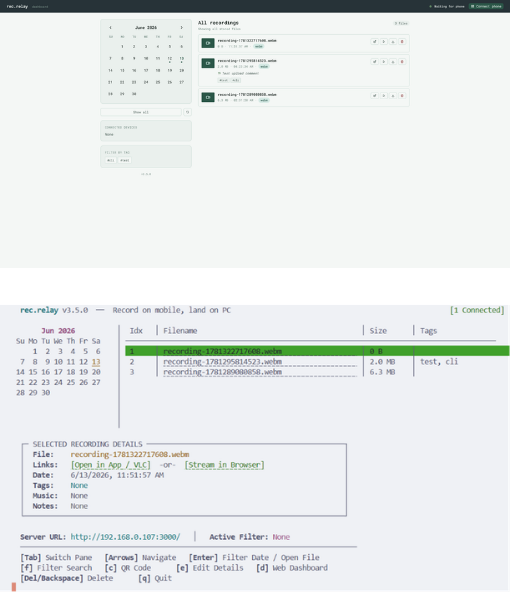

# rec.relay
> Record on mobile (or PC), land on PC over local network (P2P via WebRTC).

`rec.relay` captures video in your phone's browser and transfers it directly to your PC's hard drive over local Wi-Fi. No accounts, no cloud, no third-party servers, no app to install.

---

## Why I Made This

My phone was running out of space as they usually do and i wanted something that let me record on my phone and have it just show up on my laptop, without uploading it to Google Photos or iCloud or anything that wasn't me.

So I built this. Scan a QR code, record in the browser, tap send, done.

---

## Features

- **100% Local:** Videos stream directly from your phone to your PC. Nothing touches an external server.
- **No App Install:** Scan the QR code, record in your mobile browser, sync immediately.
- **Orientation-Aware:** Detects portrait and landscape mode automatically and adjusts recording output.
- **Terminal UI (TUI):** Command-line interface with a calendar view, file list, QR code overlays, and quick actions.
- **Web Dashboard:** Browser-based playback with recording management, tags, notes, and audio references.
- **Auto-Updater:** Checks for new releases on startup and supports self-updating from the terminal.

---

## Running It

Requires Node.js v18+.

```bash
npx github:theronvspr/rec.relay
```

This starts the Express server, prints a QR code in your terminal, and opens the Web Dashboard at `http://localhost:3000/dashboard`. Recordings are saved to `./uploads` in whichever directory you ran the command from.

---

## How to Use

1. **Start rec.relay** on your PC.
2. **Scan the QR code** shown in your terminal or web dashboard on your phone.
3. **Record a clip** using the browser interface on your phone.
4. **Tap "Send to PC".** The video transfers over WebRTC directly to your machine.
5. **Manage recordings** from the terminal interface or the Web Dashboard.

---

## TUI Shortcuts

| Key | Action |
|-----|--------|
| `[Tab]` | Switch between **Recordings List** and **Calendar** |
| `[Arrows]` | Navigate lists or calendar days |
| `[Enter]` | Filter by selected date / Open stream in browser |
| `[f]` | Search tags and comments in real-time |
| `[c]` | Toggle QR code overlay |
| `[e]` | Edit recording metadata (notes, tags, music reference) |
| `[d]` | Open Web Dashboard in browser |
| `[u]` | Run git update (only when inside a git clone) |
| `[Del / Backspace]` | Delete selected recording |
| `[q]` | Shut down server and exit |

## Screenshots

**Mobile recording interface**


**Web Dashboard and Terminal UI**

